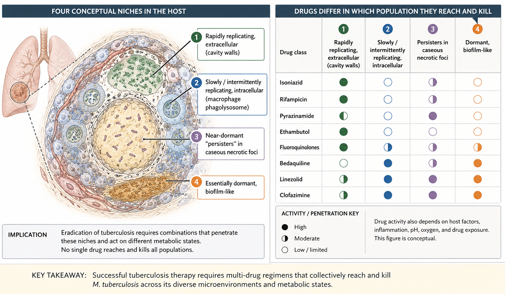

## Anti-Tuberculosis Agents {background-video="anti-tb-drugs-images/tb.mp4" background-video-muted="true" background-video-loop="true" background-color="#b20e10" background-opacity="0.5"}

**Russell E. Lewis, Pharm.D**   Associate Professor of Infectious Diseases (MEDS-10/B)  

   

{fig-align="center" width="350"}

   russelledward.lewis\@unipd.it    [https://github.com/Russlewisbo](https://github.com/Russlewisbo/ESCMID_2022_talk)   Slides and course materials: [www.idpadova.com](https://padovaid.com/)

 

## Learning Objectives

 

- Map each antituberculous drug to the **bacillary sub-population** and **microenvironment** it kills, and distinguish *bactericidal* from *sterilizing* activity
- Recall mechanism of action, key resistance gene, pharmacokinetics, and signature toxicity for the first-line agents and the principal second-line and novel agents
- Explain why tuberculosis is treated with **combination regimens** and how mutation frequencies drive regimen design
- Construct current regimens: standard 6-month RIPE, the **4-month rifapentine–moxifloxacin** regimen, and the all-oral **BPaL / BPaLM** regimens for drug-resistant disease
- Anticipate the major **drug–drug interactions** (rifamycins, QT-prolonging agents) and apply therapeutic drug monitoring where it matters

## Roadmap

 

- **Foundations:** burden, resistance definitions, the pharmacology that governs everything
- **First-line agents:** isoniazid, rifampin, pyrazinamide, ethambutol
- **Shortening drug-susceptible therapy**: the 4-month regimen
- **Rifamycins beyond rifampin;** second-line and repurposed agents
- **The novel agents:** bedaquiline, pretomanid, delamanid
- **Modern all-oral regimens for drug-resistant TB** (BPaL, BPaLM, endTB)
- **Cross-cutting:** HIV co-treatment, TDM, QT stewardship
- **A brief tour of NTM drug therapy**

# Foundations {background-color="#b20e10"}

## The global burden — Why this still matters

 

- Tuberculosis is the **leading infectious cause of death worldwide**, ahead of HIV/AIDS
- \~**10.6 million** incident cases and \~**1.3 million** deaths per year (WHO Global TB Report)
- \~**410,000** cases of MDR/RR-TB annually; only \~2 in 5 are diagnosed and treated
- Drug resistance is the central driver of pharmacological complexity — and the reason this field has moved so fast

::: aside
[@WHO2023gtr]
:::

## Important resistance definitions

 

- **Drug-susceptible (DS) TB** — susceptible to rifampin and isoniazid
- **INH-resistant, rifampin-susceptible (Hr-TB)** — a distinct, common category with its own regimen
- **RR-TB** — rifampin-resistant (rifampin is the sentinel; RR is managed as MDR)
- **MDR-TB** — resistant to **at least isoniazid and rifampin**

::: aside
Rifampin resistance is the pivot: molecular detection of an rpoB mutation (e.g. Xpert MTB/RIF) is treated as a proxy for MDR until proven otherwise, because isolated rifampin resistance is uncommon and usually flags concomitant INH resistance. Hr-TB deserves emphasis — it is more common than MDR, is easy to under-treat, and has its own recommended regimen (rifampin–ethambutol–pyrazinamide–levofloxacin) [@WHO2022mod4; @Nahid2019drtb].
:::

## Resistance definitions — The 2021 revision

 

- **Pre-XDR-TB** — MDR/RR-TB **plus** resistance to any **fluoroquinolone**
- **XDR-TB (2021 definition)** — MDR/RR-TB + fluoroquinolone resistance + resistance to **at least one Group A drug** (bedaquiline *or* linezolid)
- This replaced the older XDR definition (MDR + FQ + a second-line **injectable**)
- The change reflects that injectables are no longer core drugs — **Group A orals define severity now**

::: aside
The textbook definition of XDR (INH + RIF + any FQ + a second-line injectable) is obsolete. WHO redefined XDR in 2021 around the drugs that actually anchor modern regimens: fluoroquinolones and the Group A oral agents bedaquiline and linezolid. If a candidate quotes the injectable-based definition in an exam today, it is wrong. The conceptual point: our definition of "extensively resistant" now tracks resistance to the drugs we most rely on, which are all oral [@WHO2022mod4].
:::

## The central concept: Bacillary populations

 

{fig-align="center" width="800"}

::: aside
The cavity population is huge (10^8–10^10 organisms), extracellular, rapidly dividing, acid-neutral pH — this is where resistance is selected and where bactericidal activity matters most. The intracellular and caseous populations are where *sterilizing* activity — the ability to prevent relapse — is decided.
:::

## Drugs mapped to the populations

 

| Population / niche | Best drugs |
|------------------------------------|------------------------------------|
| Rapidly replicating, extracellular (cavity) | **Isoniazid** (early kill), rifampin |
| Intracellular, acidic phagolysosome | **Pyrazinamide**, rifampin |
| Near-dormant, caseous necrotic foci | **Rifampin** (sterilizing), pyrazinamide |
| Companion / resistance-protection | **Ethambutol** |

::: aside
Isoniazid gives the fastest early bactericidal activity (drops the cavity burden and infectiousness quickly) but is a weak sterilizer. Rifampin and pyrazinamide are the sterilizing backbone — they hit the slow and dormant populations, and their combination is what allowed 6-month therapy. Pyrazinamide is uniquely active at the acid pH inside macrophages and does little elsewhere. Ethambutol is bacteriostatic; its job is to protect rifampin from resistance when unrecognised INH resistance is present. This single mental model explains the composition of RIPE.
:::

## Bactericidal vs. sterilizing activity

 

- **Early bactericidal activity (EBA)** — rate of kill of actively dividing bacilli in the first days (measured as fall in sputum CFU); best for **isoniazid**
- **Sterilizing activity** — ability to kill persisters and prevent relapse; best for **rifampin and pyrazinamide**
- Regimen shortening depends on **sterilizing power**, not EBA
- This is why rifamycin optimization (higher doses, rifapentine) and moxifloxacin are the levers for shorter DS-TB therapy

::: aside
A drug can drop the sputum count fast (good EBA) yet do nothing to shorten therapy if it cannot kill persisters. Conversely rifampin's steep sterilizing activity is why relapse rates are acceptable at 6 months. The entire 4-month-regimen programme (Study 31) is a bet on maximizing rifamycin exposure (rifapentine) plus adding moxifloxacin's sterilizing contribution [@Dorman2021].
:::

## Why combination therapy — The arithmetic of resistance

 

- Spontaneous resistance mutations pre-exist in any large bacillary population
- Approximate mutation frequencies: INH \~1 in 10⁶, rifampin \~1 in 10⁸, together \~1 in 10¹⁴
- A pulmonary cavity holds \~10⁸–10¹⁰ organisms — enough to contain INH- **and** rifampin-resistant mutants
- **No effective drug should ever be added alone to a failing regimen** — that is functional monotherapy

::: aside
Because resistant mutants pre-exist, monotherapy simply selects them — \>70% of patients on INH monotherapy for active disease acquire resistance within months. Two independent effective drugs make the joint mutant vanishingly rare. The corollary is the single most common iatrogenic error in TB: adding one new drug to a regimen that is already failing. That is why, when we escalate, we add two or more likely-effective drugs and confirm susceptibility[@Iseman1993].
:::

## Resistance mechanisms at a glance

 

| Drug | Target / mechanism | Resistance gene |
|------------------------|------------------------|------------------------|
| Isoniazid | Mycolic acid synthesis (pro-drug via KatG) | *katG*, *inhA* |
| Rifampin | RNA polymerase β-subunit | *rpoB* |
| Pyrazinamide | Pyrazinoic acid (pro-drug via PncA) | *pncA* |
| Ethambutol | Arabinosyl transferase | *embB* |
| Streptomycin/amikacin | Ribosome (protein synthesis) | *rpsL*, *16S rRNA* |
| Fluoroquinolones | DNA gyrase | *gyrA* |
| Bedaquiline/clofazimine | ATP synthase / efflux | *atpE*, *Rv0678* |

::: aside
These genes are exactly what line-probe assays and targeted next-generation sequencing interrogate to give resistance results within days. Two teaching points: the pro-drug pairs (INH/KatG, PZA/PncA) explain why loss-of-activation mutations confer resistance; and the shared efflux route (Rv0678/mmpR) is why bedaquiline and clofazimine can be cross-resistant. Molecular DST reports these mutations, so knowing the map lets you predict phenotype before the culture returns [@Musser1995].
:::

## Supervised therapy and adherence

 

- Universal **supervised therapy** (in-person DOT or video DOT) remains central to preventing acquired resistance
- Malabsorption (advanced HIV/AIDS) can produce subtherapeutic levels → acquired resistance
- Adherence support, not just drug choice, determines outcome
- Rapid molecular diagnostics (Xpert MTB/RIF, targeted NGS) now guide drug selection within **days**, limiting empirical exposure to toxic second-line drugs

::: aside
First, the pharmacology is necessary but not sufficient — the best regimen fails without adherence, and malabsorption is an under-recognised cause of acquired resistance in advanced HIV. Second, molecular diagnostics have transformed empirical prescribing: we can now detect rpoB (and increasingly fluoroquinolone and other) resistance within days, so we no longer have to expose patients to injectables and toxic orals while waiting weeks for phenotypic results. Rapid DST is the enabling technology behind targeted modern regimens[@Egelund2012].
:::

# First-Line Antituberculous Drugs {background-color="#b20e10"}

## The first-line four — Overview

 

| Drug | Mechanism | Resistance gene | Signature toxicity |
|------------------|------------------|------------------|------------------|
| Isoniazid (H) | Inhibits mycolic acid synthesis | *katG*, *inhA* | Hepatitis, neuropathy |
| Rifampin (R) | Inhibits DNA-dependent RNA polymerase | *rpoB* | Hepatitis, CYP induction |
| Pyrazinamide (Z) | Prodrug → pyrazinoic acid (acid pH) | *pncA* | Hepatitis, hyperuricemia |
| Ethambutol (E) | Inhibits arabinosyl transferase | *embB* | Optic neuritis |

::: aside
This is the reference table for the section — I will unpack each row. Note that three of the four are bactericidal; ethambutol is bacteriostatic and serves mainly as the resistance-protecting companion. The mnemonic RIPE captures the standard intensive phase. Keep the resistance genes in mind — they are exactly what the molecular assays interrogate [@ATS2016; @Nahid2016DSTB].
:::

## Isoniazid — mechanism and activity

 

- Synthetic pro-drug; activated by the mycobacterial **catalase-peroxidase (KatG)**
- Active metabolite inhibits **InhA**, blocking **mycolic acid** synthesis (cell-wall)
- Bactericidal against actively dividing bacilli (**best EBA of any TB drug**); weak against non-replicating organisms
- MIC 0.02–0.05 µg/mL; the workhorse of the intensive phase

::: aside
Isoniazid is the fastest killer of dividing bacilli — it drives the early drop in sputum burden and renders patients non-infectious quickly — but it is a poor sterilizer, so alone it cannot shorten therapy. The pro-drug biology matters for resistance: it must be activated by KatG, so loss of KatG confers resistance.
:::

## Isoniazid — resistance

 

- **High-level** resistance: *katG* mutations/deletions (loss of activation)
- **Low-level** resistance: *inhA* promoter mutations (also confers ethionamide cross-resistance)
- Low-level INH resistance: many experts still include INH but do **not** count it as a core drug
- INH resistance is the **most common** resistance worldwide — hence ethambutol as empirical cover

::: aside
The katG vs inhA distinction is clinically actionable. inhA mutations give low-level INH resistance and — importantly — cross-resistance to ethionamide/prothionamide, so an inhA-mutant strain undermines two drugs at once. katG mutations give high-level resistance but leave ethionamide active. Molecular assays that report the specific mutation therefore inform whether high-dose INH or ethionamide might still contribute. Hr-TB (INH-resistant, rifampin-susceptible) is common and has a dedicated regimen — do not just drop INH and carry on [@Musser1996; @Musser1995].
:::

## Isoniazid — Pharmacology

 

- Well absorbed orally; distributes widely; **CSF \~20% of plasma** (approaches plasma with inflamed meninges)
- Metabolized by hepatic **N-acetyltransferase** — genetically **fast vs slow acetylators**
- Bimodal half-life; daily dosing overcomes acetylator differences
- No renal dose adjustment; caution in hepatic disease
- Ascorbic acid (vitamin C) can inactivate INH suspensions — avoid in compounded syrups

::: notes
Acetylator status is a classic pharmacogenomic teaching point but has limited impact on daily-therapy outcomes because trough levels stay above MIC either way. It matters more for toxicity (slow acetylators → higher levels → more neuropathy) and for intermittent regimens. Good CNS penetration makes INH valuable in TB meningitis. The vitamin C point is a practical pediatric-compounding pitfall.
:::

## Isoniazid — Hepatotoxicity

 

- 10–20% have asymptomatic transaminase elevation (often resolves on therapy)
- Clinically significant hepatitis \~0.1–0.6%; risk **rises with age**, alcohol, pre-existing liver disease, pregnancy/postpartum
- Fatal/fulminant hepatitis is rare (\~1 in 150,000–220,000 for LTBI) but **idiosyncratic** and can occur any time
- **Symptom-based monitoring** is essential; baseline/serial LFTs for higher-risk groups; **stop at symptom onset**

::: aside
[@Saukkonen2006; @CDC2010INHliver]
:::

::: notes
The take-home is that biochemical monitoring alone is not protective — the severe cases are idiosyncratic and can occur despite normal recent LFTs — so patient education and prompt discontinuation at the first symptoms (nausea, anorexia, RUQ pain, jaundice) is the safety net. Baseline LFTs for those with liver disease, HIV on ART, alcohol use, pregnancy/postpartum. Continuing INH after symptom onset is what turns hepatitis into liver failure.
:::

## Isoniazid — Neuropathy and Other Toxicity

 

- Peripheral neuropathy from **pyridoxine (B6) depletion**; dose-related
- Prevent with **pyridoxine 10–25 mg/day** — universal in practice, essential in pregnancy, diabetes, alcohol use, HIV, renal failure, malnutrition
- CNS effects: memory change, psychosis, seizures (overdose → treat with **high-dose pyridoxine**)
- Rare: lupus-like syndrome, positive ANA

::: notes
Pyridoxine is cheap and prevents the commonest neurotoxicity — give it routinely. In massive INH overdose (seizures, metabolic acidosis, coma) the antidote is gram-for-gram pyridoxine. Remember INH can cause optic neuropathy that mimics ethambutol toxicity when both are used together — a diagnostic trap.
:::

## Isoniazid — Interactions and Dosing

 

- Inhibits metabolism of **phenytoin**, **carbamazepine**, **valproate** (toxicity risk) — monitor levels
- Additive hepatotoxicity with rifampin, acetaminophen
- Adult dose **5 mg/kg/day (max 300 mg)**; 15 mg/kg (max 900 mg) for intermittent regimens
- Available with rifampin ± PZA as fixed-dose combinations (improve adherence, prevent monotherapy)

::: notes
INH is a modest enzyme inhibitor — the opposite of rifampin — so the interaction set is smaller but real, especially antiepileptics in patients with seizure disorders. Fixed-dose combinations (Rifater, Rifamate) are worth flagging: they reduce pill burden and, importantly, make inadvertent monotherapy impossible, which protects against resistance.
:::

## Rifampin — Mechanism and Activity

 

- Semisynthetic rifamycin; inhibits the **β-subunit of DNA-dependent RNA polymerase** (human polymerase insensitive)
- Bactericidal against dividing organisms **and** — crucially — active against slow/near-dormant persisters
- The **sterilizing backbone**: rifampin is why therapy could be shortened to 6 months
- MIC 0.005–0.2 µg/mL; sputum conversion \~2 weeks faster in rifampin-containing regimens

::: notes
If you remember one thing about rifampin: it is the drug that kills persisters and thereby prevents relapse. Its sterilizing activity is the single most important determinant of regimen duration — lose rifampin (RR-TB) and duration jumps from months to, historically, well over a year. That is why rifampin resistance is the sentinel event that reclassifies a case as MDR-equivalent.
:::

## Rifampin — Resistance and the Higher-Dose Question

 

- \~95% of resistance from point mutations in an **81-bp region of *rpoB*** — rapidly detectable by Xpert
- Rifampin resistance ⇒ cross-resistance to **rifapentine** (always) and usually **rifabutin**
- Standard 10 mg/kg (max 600 mg) may be **suboptimal** — a 60-kg and a 100-kg patient get the same dose
- Trials of **high-dose rifampin (up to 35 mg/kg)** show good tolerability and steeper kill; not yet standard

::: aside
[@vanIngen2011]
:::

::: notes
The rpoB hot-spot is exactly what molecular assays target, giving results in hours. On dosing: the historical 600 mg cap was set for cost and old toxicity fears, not PK optimization, and there is now good evidence that higher exposures increase bactericidal and sterilizing activity with acceptable safety. High-dose rifampin is an active research front (e.g. shortening DS-TB further); it is not yet guideline-standard but expect movement. A subset of rpoB mutants remain rifabutin-susceptible — the "rifampin-resistant/rifabutin-susceptible" phenotype — of uncertain clinical exploitability.
:::

## Rifampin — Pharmacology and the CYP Problem

 

- Well absorbed (take on empty stomach); wide distribution; enterohepatic recycling
- **Autoinduction** of its own metabolism over \~1–2 weeks
- Potent inducer of **CYP3A4, 2C9, 2C19, P-glycoprotein, UGT** — interacts with **\>100 drugs**
- Orange-red discoloration of secretions (urine, tears, sweat, contact lenses) — warn patients

::: notes
Rifampin's CYP induction is the defining practical liability of the whole class. It is a broad, potent inducer that lowers exposure to a huge list of co-medications — and the effect persists for weeks after stopping. The orange secretions are harmless but tell you the patient is taking the drug (and will stain soft contact lenses). We will hit the ARV interactions specifically in the HIV section.
:::

## Rifampin — Key Interactions

 

- Markedly lowers levels of: **HIV protease inhibitors, most NNRTIs, integrase inhibitors** (dose-adjust or switch to rifabutin), warfarin, DOACs, oral contraceptives, azoles, many others
- Rifampin **contraindicated** with most boosted PIs → use **rifabutin**
- No renal or (usually) hepatic dose adjustment; not dialysed
- Adult dose **10 mg/kg/day (max 600 mg)**

::: aside
[@Venkatesan1992]
:::

::: notes
The clinically dangerous interactions to internalise: oral contraceptive failure (counsel on backup contraception), warfarin/DOAC under-anticoagulation, azole antifungal failure, and the antiretroviral interactions that force rifabutin substitution with protease inhibitors. Dolutegravir needs dose doubling with rifampin. The list is long; the safe habit is to check every co-medication against a rifamycin interaction resource at the start of therapy.
:::

## Pyrazinamide — Mechanism and Niche

 

- Synthetic nicotinamide analogue; a **pro-drug** activated by pyrazinamidase (**PncA**) to **pyrazinoic acid**
- Uniquely active at **acid pH** — kills the intracellular, semi-dormant population in phagolysosomes
- Little activity at neutral pH — a specialist sterilizing drug, not a broad killer
- Essential in the first 2 months: without PZA, relapse rates are unacceptable

::: aside
[@Scorpio1997]
:::

::: notes
Pyrazinamide is the population-specialist par excellence — it does almost nothing except kill acid-environment intracellular persisters, and that niche is exactly what makes it a sterilizing drug that permitted 6-month therapy. Resistance is via pncA (loss of activation). Nearly half of MDR isolates are also PZA-resistant, which complicates MDR regimen design and is one reason PZA is not assumed active in MDR-TB without DST.
:::

## Pyrazinamide — Toxicity and Dosing

 

- **Hepatotoxicity** — dose-related; the most common cause of hepatitis in multidrug regimens at modern doses
- **Hyperuricemia** (blocks urate excretion) — arthralgia common; acute gout mainly in predisposed patients
- Rifampin + PZA for LTBI abandoned — unacceptable severe hepatotoxicity
- Dose **20–25 mg/kg/day (max \~2 g)**; renally cleared → **reduce/dose after dialysis**

::: notes
PZA is now recognised as the biggest hepatotoxic contributor in the RIPE combination — flag that when a patient on RIPE develops hepatitis. The hyperuricemia is near-universal biochemically but symptomatic gout is uncommon except in the predisposed; PZA-induced arthralgia is usually non-gouty and manageable. The rifampin–PZA LTBI regimen is a cautionary tale — good microbiology, unacceptable liver toxicity — and is no longer used.
:::

## Ethambutol — Mechanism and Role

 

- Inhibits **arabinosyl transferase (EmbB)** → blocks arabinogalactan cell-wall synthesis
- **Bacteriostatic** — the only first-line agent that is not bactericidal
- Primary role is a **companion drug**: protects rifampin from resistance when INH resistance is unrecognised
- Dropped once INH/rifampin susceptibility confirmed

::: aside
[@Belanger1996; @Alcaide1997]
:::

::: notes
Ethambutol is included in the intensive phase not for its own killing power but as insurance: if the strain is unknowingly INH-resistant, ethambutol prevents the patient from being effectively on rifampin monotherapy while susceptibilities are pending. Once you confirm INH and rifampin susceptibility, ethambutol has done its job and can be stopped. Resistance is via embB.
:::

## Ethambutol — Optic Neuritis

 

- Signature toxicity: **dose- and duration-dependent retrobulbar (optic) neuritis**
- Bilateral blurred vision, reduced acuity, **red–green colour vision loss**
- More frequent at 25 mg/kg than 15 mg/kg; usually slowly reversible if caught early
- **Baseline and monthly** acuity + colour testing; instruct patient to **stop and report** new visual symptoms

::: notes
The one toxicity you must counsel on and monitor. Colour vision (red-green) often changes first. Risk rises with higher doses, longer therapy, and renal impairment (renally cleared — adjust the dose in renal failure). Recovery depends on early discontinuation, so patient instruction to stop the drug and seek testing at the first visual change is the key safety behaviour. In older patients with baseline eye disease, distinguishing ethambutol toxicity from cataract can be difficult.
:::

## First-Line Dosing — Quick Reference

 

| Drug         | Adult daily dose              | Note                     |
|--------------|-------------------------------|--------------------------|
| Isoniazid    | 5 mg/kg (max 300 mg)          | \+ pyridoxine            |
| Rifampin     | 10 mg/kg (max 600 mg)         | empty stomach            |
| Pyrazinamide | 20–25 mg/kg (max \~2 g)       | renal adjust             |
| Ethambutol   | 15 mg/kg (25 mg/kg if 3×/wk)  | renal adjust; eye checks |
| Rifabutin    | 5 mg/kg (\~300 mg)            | HIV/PI settings          |
| Rifapentine  | 1200 mg (4-mo regimen, daily) | with food                |

::: notes
A single practical reference — these are the doses to have at your fingertips. Two recurring themes visible in the table: the renally cleared drugs (PZA, ethambutol) need adjustment in renal impairment, and the rifamycins have opposite food requirements (rifampin empty stomach, rifapentine with food). Pyridoxine accompanies isoniazid. Weight-based dosing means re-checking as the patient's weight recovers during treatment. Second-line and novel-agent dosing was given on the respective drug slides.
:::

## The Standard Regimen for Drug-Susceptible TB

 

- **Intensive phase:** isoniazid + rifampin + pyrazinamide + ethambutol (**RIPE**) daily × 2 months
- **Continuation phase:** isoniazid + rifampin × 4 months
- Total **6 months** for most pulmonary DS-TB
- Ethambutol dropped once pan-susceptibility confirmed; pyridoxine throughout
- Extend continuation phase (to 7 months total) for cavitary disease with positive 2-month culture

::: aside
[@Nahid2016DSTB]
:::

::: notes
This is the regimen every graduate knows — but frame it through the population model: RIPE covers cavity (H), intracellular acid (Z), and persister (R) populations simultaneously, with E as resistance insurance. The 2+4 structure and the rifampin/isoniazid continuation phase reflect that once the fast-dividing burden is gone, you still need months of sterilizing R to prevent relapse. This is the comparator against which every shortening trial is judged.
:::

## Isoniazid-Resistant, Rifampin-Susceptible TB (Hr-TB)

 

- More common than MDR-TB and easy to under-treat
- Recommended regimen: **rifampin + ethambutol + pyrazinamide + levofloxacin × 6 months**
- Do **not** simply drop INH and continue standard therapy
- Confirms the principle: tailor to the specific resistance pattern, protect the rifamycin

::: aside
[@Nahid2019drtb]
:::

::: notes
Hr-TB is a common trap. Because molecular assays often report rifampin status first, a strain can be flagged rifampin-susceptible while INH resistance is missed — leaving the patient functionally under-treated if you just run standard RIPE. The recommended approach adds a fluoroquinolone (levofloxacin) to a rifampin-based backbone for 6 months. The teaching point: INH resistance is not a footnote — it has its own regimen, and getting it wrong risks amplifying to MDR.
:::

## Monitoring the Response to Therapy

 

- Baseline: cultures + DST, LFTs (as indicated), visual acuity/colour (if on ethambutol), HIV test, weight
- **Sputum smear and culture at 2 months** — positive culture predicts relapse → consider extending continuation phase
- Monthly clinical review, adherence support, weight-based dose review
- Watch for the drug-specific toxicities: hepatitis, neuropathy, optic/ocular, QT, cytopenias

::: notes
The 2-month culture is the key milestone: persistent culture-positivity at 2 months (especially with baseline cavitation) predicts relapse and drives extension of the continuation phase to 7 months. Monitoring is otherwise clinical and toxicity-directed — there is no need for routine biochemical monitoring in low-risk patients, but there is every reason for structured monthly review and symptom-triggered testing. Re-check weight and adjust weight-based doses as patients recover.
:::

# Shortening Therapy: The 4-Month Regimen {background-color="#b20e10"}

## Study 31 — A 4-Month Rifapentine–Moxifloxacin Regimen

 

- Randomized, phase 3 (Study 31 / TBTC S31 / ACTG A5349)
- **2 months** rifapentine + INH + PZA + **moxifloxacin**, then **2 months** rifapentine + INH + moxifloxacin
- **Non-inferior** to standard 6-month therapy for drug-susceptible pulmonary TB
- High-dose daily **rifapentine** (higher rifamycin exposure) + moxifloxacin's sterilizing activity = 2 months saved

::: aside
[@Dorman2021]
:::

::: notes
This is the first successful shortening of DS-TB therapy in nearly 40 years, and it validates the sterilizing-activity thesis: swap rifampin for high-exposure rifapentine and add moxifloxacin, and you can drop two months without more relapse. Note moxifloxacin, not levofloxacin — the trial used moxifloxacin specifically. It is a genuine option now, not experimental.
:::

## The 4-Month Regimen in Practice

 

- CDC interim guidance (2022) endorses it as an **option** for DS pulmonary TB, age ≥12, ≥40 kg
- Now embedded in the **2025 ATS/CDC/ERS/IDSA** update
- Also: a **4-month regimen for children** with non-severe TB (shorter, less toxic)
- Caveats: requires confirmed moxifloxacin & rifamycin susceptibility; rifapentine taken **with food**; not for HIV on incompatible ART, pregnancy, or extrapulmonary/severe disease per label

::: aside
[@Carr2022; @Saukkonen2025]
:::

::: notes
Practical eligibility matters: it is for drug-susceptible pulmonary disease with documented fluoroquinolone susceptibility, weight and age thresholds apply, and rifapentine must be taken with a meal for adequate absorption (opposite of rifampin). The 2025 guideline also endorses a shorter 4-month regimen for children with non-severe disease — a separate, welcome development. For our European practice, uptake varies, but knowing the eligibility criteria is exam- and clinic-relevant.
:::

# Rifamycins Beyond Rifampin {background-color="#b20e10"}

## Rifabutin

 

- Rifamycin-S derivative; same target (RNA polymerase); long half-life (\~45 h), high tissue penetration
- **Weaker CYP3A4 inducer** than rifampin → preferred rifamycin with **HIV protease inhibitors**
- \~25% of rifampin-resistant strains remain rifabutin-susceptible (variable clinical value)
- Toxicity: **uveitis** (with clarithromycin/ritonavir/fluconazole), neutropenia, pseudojaundice, orange secretions

::: aside
[@Blaschke1996; @OBrien1987]
:::

::: notes
Rifabutin's niche is the HIV patient on a protease-inhibitor regimen: it retains rifamycin efficacy while inducing CYP much less, so PIs remain usable with dose adjustment. Watch for uveitis — it is dose-related and potentiated by CYP inhibitors that raise rifabutin levels (clarithromycin, ritonavir, azoles). The rifampin-resistant/rifabutin-susceptible phenotype exists but its clinical exploitation is uncertain.
:::

## Rifapentine

 

- Long half-life (\~14–16 h); **bioavailability increases with food** (opposite of rifampin)
- Potent P-450 inducer; cross-resistant with rifampin
- **3HP** — rifapentine + INH once weekly × 12 weeks — a preferred **LTBI** regimen (high completion)
- Now also the rifamycin in the **4-month DS-TB** regimen (daily, high dose)

::: aside
[@Sterling2011; @Alfarisi2017]
:::

::: notes
Rifapentine has had two act. First, once-weekly 3HP transformed latent TB treatment — 12 doses, directly observed or self-administered, with far better completion than 9 months of INH. Second, at daily high dose it is the engine of the 4-month active-TB regimen. The food effect is the mirror image of rifampin — rifapentine must be taken with food. It is contraindicated in HIV patients on PIs/NNRTIs because of interactions and rifamycin monoresistance risk.
:::

## Latent TB Infection — Rifamycin-Preferred Now

 

- Preferred short regimens (all rifamycin-based, better completion, less hepatotoxicity than 9H):
  - **3HP** — weekly rifapentine + INH × 12 weeks
  - **4R** — daily rifampin × 4 months
  - **3HR** — daily rifampin + INH × 3 months
- 6–9 months of INH monotherapy is now a fallback, not first choice
- Screen for and **exclude active TB** before treating latent infection

::: aside
[@Sterling2011; @Borisov2018]
:::

::: notes
Even though this is a drug-treatment lecture centred on active disease, specialists prescribe LTBI therapy constantly and the field has shifted decisively to shorter rifamycin-based regimens (3HP, 4R, 3HR) because they finish and are less hepatotoxic than the old 9 months of isoniazid. The non-negotiable safety step is excluding active disease first — treating active TB as if it were latent is monotherapy and breeds resistance. Rifamycin interactions still apply, so review co-medications.
:::

# Second-Line and Repurposed Agents {background-color="#b20e10"}

## Fluoroquinolones — The Backbone of MDR Oral Therapy

 

- Inhibit **DNA gyrase** (*gyrA*); bactericidal, excellent tissue/CNS penetration, long half-life
- **Moxifloxacin** and **levofloxacin** are the active agents; ciprofloxacin/ofloxacin are too weak — **do not use**
- A **Group A** drug; fluoroquinolone resistance defines **pre-XDR-TB**
- Doses: levofloxacin 750–1000 mg/day; moxifloxacin 400 mg/day (higher for CNS/elevated MIC)

::: aside
[@Ginsburg2003; @Nahid2019drtb]
:::

::: notes
Fluoroquinolones are the single most important second-line class and are now core (Group A) drugs in modern regimens. Emphasise moxifloxacin and levofloxacin only — the older quinolones lack the potency and should not be counted as effective. Because FQ resistance moves a case to pre-XDR and knocks out a Group A drug, FQ susceptibility testing (molecular gyrA and phenotypic) is critical before building a regimen. A practical hazard: empirical fluoroquinolones for "pneumonia" partially treat unrecognised TB and select FQ resistance — a real problem when TB is the missed diagnosis.
:::

## Fluoroquinolones — Safety

 

- **QT-interval prolongation** (moxifloxacin \> levofloxacin) — additive with bedaquiline, clofazimine, delamanid
- Tendinopathy/rupture, dysglycemia, CNS effects, photosensitivity
- Avoid in pregnancy where alternatives exist; renal dose-adjust levofloxacin (not moxifloxacin)
- Separate from divalent cations (antacids) by ≥2 h — chelation reduces absorption

::: notes
The QT signal is the one that shapes modern regimen safety because MDR regimens stack multiple QT-prolonging drugs (FQ + bedaquiline + clofazimine). We will address the combined QT stewardship problem later. Levofloxacin is renally cleared (dose-adjust); moxifloxacin is not, but moxifloxacin prolongs QT more. The antacid chelation interaction is a common cause of subtherapeutic exposure.
:::

## Linezolid — A Cornerstone Oxazolidinone

 

- Inhibits bacterial protein synthesis (23S rRNA, 50S); MIC \<1 µg/mL vs *M. tuberculosis*
- Oral bioavailability \~100%; a **Group A** drug — now **essential** to drug-resistant regimens
- Replaces the weaker/toxic older orals (cycloserine, ethionamide, PAS)
- TB dose **600 mg once daily** (not the 600 mg **twice** daily used for bacterial infection)

::: aside
[@Lee2012; @Nahid2019drtb]
:::

::: notes
Linezolid's promotion from salvage drug to Group A cornerstone is one of the big shifts. It is the "L" in BPaL. The dosing distinction is a common error: for TB we use 600 mg once daily to limit cumulative toxicity, not the twice-daily dosing used for resistant gram-positives. Its inclusion is why regimens could drop the old toxic bacteriostatics.
:::

## Linezolid — Toxicity Drives Dosing

 

- Toxicity from **mitochondrial protein synthesis inhibition**, cumulative over weeks–months:
  - **Myelosuppression** (reversible)
  - **Peripheral and optic neuropathy** (may be **irreversible**)
  - Lactic acidosis
- **Serotonin syndrome** with SSRIs/serotonergic drugs; tyramine caution
- ZeNix trial optimized **dose/duration** to reduce toxicity while preserving efficacy

::: aside
[@Conradie2022zenix]
:::

::: notes
Linezolid is effective but its long-course toxicity is the limiting factor, and peripheral neuropathy in particular can persist after stopping. The ZeNix trial is the practice-changer here: it showed that a shorter/lower linezolid exposure (e.g. 600 mg for 26 weeks, or de-escalation) within BPaL retains efficacy with substantially less neuropathy and myelosuppression — so current practice favours the optimized linezolid exposure rather than prolonged high-dose. Monitor CBC and for neuropathy; watch serotonergic co-medication.
:::

## Injectable Agents — From Core to Salvage

 

- **Amikacin, streptomycin, capreomycin, kanamycin** — inhibit protein synthesis (16S rRNA / *rpsL*)
- Once central to MDR therapy; now **relegated to salvage** by all-oral regimens
- Shared toxicity: **ototoxicity (often irreversible), nephrotoxicity, vestibular**; require TDM
- **Amikacin** preferred when an injectable is unavoidable (levels available); streptomycin second-line

::: aside
[@Nahid2019drtb]
:::

::: notes
This is one of the most important "what changed" messages. The injectables are no longer part of standard MDR therapy — the move to all-oral regimens (bedaquiline replacing the injectable) was driven precisely by the irreversible hearing loss and renal toxicity these drugs caused. They persist only as salvage options for specific resistance patterns, ideally amikacin with TDM. If a trainee proposes an injectable-containing MDR regimen as first choice, that is out of date.
:::

## A Note on Streptomycin

 

- The first effective antituberculous drug (1940s); aminoglycoside, inactive intracellularly
- Now a **second-line injectable**, superseded by amikacin (levels widely available; less cross-resistance)
- Resistance via *rpsL* / 16S rRNA; **not** cross-resistant with amikacin/kanamycin
- Retains historical and DST relevance; vestibular \> auditory/renal toxicity; category D in pregnancy

::: notes
Streptomycin is largely of historical and susceptibility-testing interest now, but worth a slide because it still appears on DST panels and its cross-resistance pattern is a classic exam point: streptomycin resistance does not predict amikacin resistance, so a streptomycin-resistant strain may still be amikacin-susceptible (unless prior kanamycin/amikacin exposure). It is more vestibulotoxic and less nephro/ototoxic than the other aminoglycosides, and it is teratogenic (category D).
:::

## Older Oral Agents — Now Rarely Needed

 

- **Cycloserine** — cell-wall synthesis; **CNS/psychiatric toxicity** (seizures, depression, suicidality); needs **TDM** (peak 20–35 µg/mL)
- **Ethionamide/prothionamide** — mycolic acid synthesis; severe **GI intolerance**, **hypothyroidism**; *inhA* cross-resistance with INH
- **Para-aminosalicylic acid (PAS)** — folate pathway; severe GI intolerance, hypothyroidism
- Displaced by linezolid, bedaquiline, and companions — used only when better drugs fail or are unavailable

::: aside
[@Nahid2019drtb]
:::

::: notes
These are the drugs the new regimens let us largely retire. Cycloserine's neuropsychiatric toxicity (contraindicated with seizure disorder and severe depression) and mandatory TDM make it difficult; ethionamide's GI intolerance and hypothyroidism (check TSH, worse with PAS) limit adherence; PAS is similar. The inhA cross-resistance point is worth repeating: an inhA-mutant strain is resistant to both INH and ethionamide. Know these for completeness and for salvage regimens, but they are no longer front-line.
:::

## Clofazimine and the β-Lactams

 

- **Clofazimine** — riminophenazine; **Group B** companion in MDR regimens; skin/conjunctival discoloration, QT prolongation, GI; long half-life
- Cross-resistance with **bedaquiline** via *Rv0678/mmpR* efflux mutations — a real concern
- **Meropenem–clavulanate** — clavulanate inhibits the mycobacterial **BlaC** β-lactamase; niche use in complex resistance, adds IV burden
- β-lactams are generally poor against intracellular bacilli

::: aside
[@DeLorenzo2013]
:::

::: notes
Clofazimine is a useful Group B companion but note two things: it adds to the QT burden, and — importantly — efflux-pump mutations (Rv0678) can confer cross-resistance to both clofazimine and bedaquiline, so pairing them is not free of interaction at the resistance level. Meropenem-clavulanate is a clever exploitation of clavulanate against the mycobacterial beta-lactamase, but it is IV, cumbersome, and reserved for difficult resistance patterns. These are supporting players, not headliners.
:::

# The Novel Agents {background-color="#b20e10"}

## Bedaquiline — A New Mechanism

 

- Diarylquinoline; inhibits mycobacterial **ATP synthase** (unique target) — slowly bactericidal
- Extremely **long terminal half-life (\~5.5 months)**; \>99% protein bound; CYP3A4-metabolized
- A **Group A** drug; central to all modern all-oral DR-TB regimens
- Dose: 400 mg daily × 2 weeks, then 200 mg three times weekly (or weight-based short-course dosing)

::: aside
[@Andries2005; @VanHeeswijk2014]
:::

::: notes
Bedaquiline is the drug that made all-oral MDR therapy possible — it replaced the injectable. Novel target (ATP synthase), so no cross-resistance with existing classes. The extraordinarily long half-life means it persists for months after stopping, which has implications for resistance if a companion drug fails late. Being CYP3A4-metabolized, its levels fall with rifampin (avoid) and rise with strong inhibitors.
:::

## Bedaquiline — Safety and the QT Story

 

- **QT prolongation** (via the M2 metabolite) — additive with fluoroquinolones, clofazimine, delamanid
- Original **black-box warning** on excess deaths in the phase 2b trial
- Subsequent large-scale programmatic use has **not** confirmed an excess mortality signal
- Baseline and serial **ECG + electrolytes (K⁺, Mg²⁺, Ca²⁺)**; correct before and during therapy

::: aside
[@Diacon2009; @Avorn2013]
:::

::: notes
The mortality signal in the small early trial drove the black box, but it has not held up in the much larger real-world experience, and bedaquiline is now a first-choice drug endorsed by WHO. The genuine ongoing concern is QT — manageable with ECG and electrolyte monitoring, but real when stacked with other QT-prolonging drugs, which is the norm in MDR regimens. Correct hypokalemia/hypomagnesemia before starting.
:::

## Pretomanid and Delamanid — The Nitroimidazoles

 

- Both are nitroimidazoles; bioreductively activated → generate reactive species damaging **mycolic acid synthesis and respiration**
- Active against replicating **and** non-replicating bacilli; **low interaction potential** (no rifampin-like induction)
- **Pretomanid** — approved **only as part of BPaL/BPaLM** (not as a standalone or substitutable drug)
- **Delamanid** — QT prolongation; efficacy signal weaker in phase 3; combinable with bedaquiline

::: aside
[@Gils2022; @Gler2012]
:::

::: notes
Distinguish the two clearly. Pretomanid is licensed strictly within the BPaL(M) combination — it is not a drug you mix and match, and it should not be used outside its studied regimens. Delamanid came first (EMA conditional approval) but its phase 3 data were equivocal (the endTB observational work suggests limited added value on top of strong Group A drugs), and it prolongs QT. Both are rifampin-interaction-light because they do not induce CYP the way rifamycins do — useful in HIV co-treatment. Their exact mechanism remains incompletely defined but centres on radical generation and mycolic acid/respiration disruption.
:::

# Modern Regimens for Drug-Resistant TB {background-color="#b20e10"}

## BPaL — The Nix-TB Breakthrough

 

- **B**edaquiline + **Pa** (pretomanid) + **L**inezolid — all oral, 6 months
- Nix-TB: highly drug-resistant (XDR, treatment-intolerant/failing MDR) pulmonary TB
- \~**90% favourable outcomes** in a population that historically had dismal prognosis
- FDA approval of pretomanid (2019) within this regimen — a paradigm shift

::: aside
[@Conradie2020nixtb]
:::

::: notes
Nix-TB is the trial that changed everything for the most resistant disease. A 6-month, three-drug, entirely oral regimen achieving \~90% success in XDR/failing-MDR patients who previously faced 18–24 months of toxic injectable-containing therapy with far worse outcomes. This is arguably the single most important advance in TB therapeutics in decades. The open question it left was linezolid dosing/toxicity — answered by ZeNix.
:::

## ZeNix — Optimizing the Linezolid Dose

 

- Compared linezolid **dose (1200 vs 600 mg)** and **duration (26 vs 9 weeks)** within BPaL
- **600 mg for 26 weeks** preserved efficacy with **markedly less** neuropathy and myelosuppression
- Established the modern linezolid exposure in BPaL(M)
- Reinforces: linezolid efficacy is retained at lower, safer exposure

::: aside
[@Conradie2022zenix]
:::

::: notes
ZeNix is the practical companion to Nix-TB: it answered "how much linezolid, for how long?" and showed that the lower 600 mg dose for the shorter duration keeps efficacy while sharply cutting the toxicity that limited the original regimen. This is why current BPaL uses 600 mg. It is a model of dose-optimization trials making an effective-but-toxic drug tolerable.
:::

## BPaLM — TB-PRACTECAL and the New Standard

 

- **BPaLM** = BPaL **+ moxifloxacin**, 24 weeks, all-oral
- TB-PRACTECAL: BPaLM **superior** to the standard 9–20 month regimen for RR/MDR-TB — better efficacy **and** safety
- WHO now recommends **BPaLM as the preferred regimen** for most RR/MDR-TB (FQ-susceptible), and BPaL when moxifloxacin cannot be used
- Endorsed in the **2025 ATS/CDC/ERS/IDSA** update

::: aside
[@Nyangwa2022; @Saukkonen2025]
:::

::: notes
This is the headline practice change for MDR/RR-TB. TB-PRACTECAL took BPaL, added moxifloxacin, and showed superiority — not just non-inferiority — to the old long regimen, on both efficacy and safety. WHO's 2022 update made BPaLM the preferred 6-month regimen for most RR/MDR-TB where fluoroquinolone susceptibility is present; BPaL (without moxifloxacin) is the fallback when FQ resistance or intolerance applies. So the modern MDR pathway is: confirm FQ susceptibility → BPaLM for 6 months, all oral. Compare that to the injectable-laden 18-24 month regimens of a decade ago.
:::

## endTB — More All-Oral Options

 

- endTB randomized trial: several **9-month, all-oral, bedaquiline/delamanid-based** regimens for **FQ-susceptible** RR/MDR-TB
- Multiple regimens **non-inferior** to the standard, expanding the menu (useful for drug intolerance, availability, pregnancy considerations)
- The observational endTB analysis: adding delamanid to three strong drugs added **little** — regimen strength matters more than drug count

::: aside
[@Guglielmetti2025endtb; @Rodriguez2023endtb]
:::

::: notes
endTB matters because it broadens the toolkit beyond BPaLM: several 9-month all-oral regimens work, giving flexibility when a patient cannot take a component of BPaLM or when local drug availability differs. The observational companion analysis makes a subtle but important point — once you have three genuinely effective drugs, bolting on a fourth (delamanid) adds little. That reframes regimen design around a few strong drugs rather than maximizing the count, which is the older MDR philosophy.
:::

## WHO Drug Groupings — Still Useful for Individualization

 

| Group | Drugs |
|------------------------------------|------------------------------------|
| **A** (all three, unless contraindicated) | Levofloxacin/**moxifloxacin**, **bedaquiline**, **linezolid** |
| **B** (add one or both) | **Clofazimine**, cycloserine/terizidone |
| **C** (fill/complete the regimen) | Ethambutol, delamanid, pyrazinamide, imipenem–cilastatin/meropenem, amikacin, ethionamide, PAS |

::: aside
[@WHO2022mod4]
:::

::: notes
When a standardised 6-month regimen (BPaLM) cannot be used — extensive resistance, intolerance, drug interactions, pregnancy — you individualise a longer regimen using the A/B/C hierarchy: all three Group A drugs, then add Group B, then complete with Group C. The grouping ranks drugs by efficacy-to-toxicity. Note that the injectables and the old oral bacteriostatics have fallen to Group C — the bottom of the priority list — confirming the whole trajectory of this lecture. This framework is what you reach for when the patient does not fit the standard shortened regimen.
:::

## Drug-Resistant TB — The Take-Home Logic

 

- Confirm **rifampin resistance** (molecular) → treat as MDR
- Test **fluoroquinolone** susceptibility → decides BPaLM vs BPaL and pre-XDR status
- **Preferred:** BPaLM 6 months, all oral (FQ-susceptible); BPaL if FQ can't be used
- **Individualize** (longer, Group A→B→C) only when the shortened regimen doesn't fit
- Injectables and old bacteriostatics are now **last-resort**

::: aside
[@Saukkonen2025; @Nyangwa2022]
:::

::: notes
This is the summary algorithm for MDR-TB in 2026. The whole approach is now molecular-diagnosis-led and oriented toward the shortest, all-oral, most tolerable regimen the resistance pattern allows. It is a dramatic simplification and improvement over the era most textbooks describe. If you internalise one pathway from the DR-TB section, make it this slide.
:::

# Cross-Cutting Principles {background-color="#b20e10"}

## Co-Treating TB and HIV

 

- Treat **both**; start TB therapy first, then ART — do not delay ART unduly
- **CD4 \<50:** start ART within **2 weeks**; **CD4 ≥50:** by **8–12 weeks** (individualize for TB meningitis)
- Rifamycin ↔ ART interactions dominate: **rifabutin** with protease inhibitors; **dolutegravir** dose-doubled with rifampin
- Watch for **IRIS**; continue both therapies through it

::: aside
[@NIH_ARV; @CDC_TBHIV]
:::

::: notes
The timing rule is high-yield: earlier ART (within 2 weeks) for the most immunosuppressed reduces mortality, but for TB meningitis early ART increases harm (IRIS in a closed space) so that is the exception. The pharmacology hazard is the rifamycin–ART interaction: rifampin wrecks PI levels (switch to rifabutin), and dolutegravir needs twice-daily dosing with rifampin. The nitroimidazoles (pretomanid, delamanid) and bedaquiline have gentler interaction profiles, which is an advantage in DR-TB/HIV co-treatment, though bedaquiline levels still fall with rifampin (not usually co-administered anyway).
:::

## Therapeutic Drug Monitoring

 

- Not routine for most patients, but **essential** where toxicity/efficacy is level-dependent:
  - **Amikacin** (avoid ototoxicity), **cycloserine** (avoid CNS toxicity)
- Consider TDM for: malabsorption, HIV, diabetes, renal/hepatic dysfunction, slow response, drug interactions
- Emerging **less-invasive matrices** (dried blood spots, urine, saliva, hair) may widen feasibility

::: aside
[@Rao2023tdm]
:::

::: notes
TDM is targeted, not universal — the guidelines are clear it cannot predict cure but it enables rational dose adjustment when it matters. For amikacin and cycloserine it is effectively mandatory to stay in the therapeutic window. Reach for it when absorption or clearance is unpredictable (advanced HIV, diabetes, organ dysfunction) or when a patient responds slowly. The newer sampling matrices are worth knowing about because they could make TDM feasible in high-burden, low-resource settings where venous sampling logistics are the barrier.
:::

## QT Stewardship in Modern Regimens

 

- Modern DR-TB regimens **stack QT-prolonging drugs**: bedaquiline + moxifloxacin + clofazimine (+ delamanid)
- Baseline and periodic **ECG**; keep **K⁺ and Mg²⁺** replete
- Avoid other QT-prolonging co-medications where possible; caution with hypothyroidism (ethionamide)
- Individual drug risk is modest — the **additive** burden is the practical concern

::: notes
This deserves its own slide because it is the recurring safety theme of the novel-regimen era. No single agent's QT effect is dramatic, but BPaLM plus clofazimine can stack three or four QT-prolonging drugs, so monitoring and electrolyte management become routine. Practically: baseline ECG, correct and maintain potassium and magnesium, avoid piling on other QT offenders (some antiemetics, azoles, etc.), and remember ethionamide-induced hypothyroidism can itself prolong QT.
:::

## Special Populations

 

- **Pregnancy:** INH (with pyridoxine), rifampin, ethambutol are used; **PZA** used by WHO/Europe but historically deferred in the US; **avoid** aminoglycosides (ototoxic) and fluoroquinolones where possible; bedaquiline/pretomanid data expanding
- **Renal failure:** adjust **PZA, ethambutol, levofloxacin, aminoglycosides**; INH/rifampin/moxifloxacin usually unchanged; dose after dialysis
- **Hepatic disease:** the hepatotoxic trio (INH, rifampin, **PZA**) needs caution/monitoring; consider PZA-sparing regimens
- **Children:** shorter 4-month regimen for non-severe disease; weight-band dosing; pediatric FDCs

::: aside
[@Saukkonen2025]
:::

::: notes
A consolidated special-populations slide. In pregnancy the first-line orals are broadly safe (with pyridoxine for INH); the transatlantic PZA difference is a nice teaching nuance — WHO and Europe use it routinely, the US historically deferred it, meaning US pregnant patients often needed 9 months. Avoid aminoglycosides (fetal ototoxicity) and, where alternatives exist, fluoroquinolones. Renal failure mainly affects the renally cleared drugs (PZA, ethambutol, levofloxacin, aminoglycosides) — dose after dialysis. In hepatic disease the INH/rifampin/PZA trio is the concern, and PZA-sparing regimens may be prudent. Paediatrics now has its own shortened option for non-severe disease.
:::

## A European / Italian Perspective

 

- US-centric guidance differs from **EUCAST** breakpoints and WHO operational regimens
- European MDR epidemiology: more **OXA / fluoroquinolone-resistant** imported strains from the former Soviet region
- WHO **BPaLM/BPaL** operational guidance is the primary framework for RR/MDR-TB in Europe
- Confirm local availability of bedaquiline, pretomanid, delamanid, and rapid FQ DST

::: notes
For this audience, ground the guidance in our reality: we work to EUCAST, not CLSI, breakpoints, and our MDR caseload is skewed by imported strains from high-MDR settings with more fluoroquinolone resistance — which directly affects whether BPaLM or BPaL is appropriate. The WHO operational handbook, not the US guideline, is our day-to-day reference. And access to the novel drugs and to rapid fluoroquinolone susceptibility testing shapes what is actually deliverable. This is where the pharmacology meets our clinic.
:::

# A Brief Tour: NTM Drug Therapy {background-color="#b20e10"}

## NTM — A Different Pharmacologic World

 

- Nontuberculous mycobacteria are **intrinsically more resistant** and species-specific in susceptibility
- In-vitro susceptibility correlates with outcome for only a few drugs (**macrolides, amikacin**)
- Longer, multidrug, often less satisfying regimens than for TB
- Distinguish **infection from colonization** before treating (especially respiratory isolates)

::: aside
[@Griffith2007; @Daley2020ntm]
:::

::: notes
I include NTM as a brief coda because the drugs overlap but the rules differ sharply. NTM susceptibility is highly species-dependent and in-vitro results predict clinical response for only a handful of drugs (macrolides and amikacin for MAC). Treatment is longer, multidrug, and outcomes are more modest. The commonest error is treating colonization — a single positive respiratory culture in an asymptomatic patient is often not disease. A full NTM lecture is separate; here I want the pharmacologic contrasts.
:::

## NTM — Macrolides and Amikacin

 

- **Macrolides (azithromycin/clarithromycin)** are the **cornerstone** for macrolide-susceptible MAC and *M. abscessus* subsp.
- **Never** macrolide monotherapy — 23S rRNA point mutation → high-level cross-resistance and failure
- **Amikacin** (IV, or **liposomal inhaled ALIS** for refractory MAC) is the key second agent
- Companion drugs (ethambutol, rifamycin for MAC) protect the macrolide from resistance

::: aside
[@Daley2020ntm; @Griffith2007]
:::

::: notes
For MAC pulmonary disease the standard is a macrolide + ethambutol + a rifamycin, three times weekly for nodular-bronchiectatic disease or daily for cavitary/severe. The single most important rule mirrors TB: never expose the macrolide unprotected, because a 23S rRNA mutation causes irreversible macrolide resistance and is associated with treatment failure and mortality. Liposomal inhaled amikacin (ALIS) is the guideline add-on for refractory MAC. Ethambutol here is again the resistance-protecting companion.
:::

## NTM — The M. abscessus Problem and New Agents

 

- ***M. abscessus*** carries an inducible **erm(41)** methylase → macrolide resistance emerges on exposure (subspecies-dependent)
- Requires prolonged multidrug therapy: amikacin + a β-lactam (imipenem/cefoxitin) + companions ± tigecycline/eravacycline
- Newer options: **omadacycline, eravacycline, tedizolid, clofazimine, dual β-lactam** combinations — mostly limited data
- Outcomes remain poor — a major unmet need

::: aside
[@Daley2020ntm]
:::

::: notes
M. abscessus is the hardest common NTM: the inducible erm(41) gene (functional in subsp. abscessus and bolletii, truncated in massiliense) means apparent macrolide susceptibility can be lost on exposure, so the macrolide may be unreliable. Treatment is prolonged, IV-heavy, and often disappointing. The newer tetracyclines (omadacycline, eravacycline — oral omadacycline is attractive), tedizolid, clofazimine, and synergistic dual β-lactam combinations are areas of active investigation but with limited trial evidence. This is where NTM therapeutics most resembles the pre-modern TB era — toxic, long, and uncertain.
:::

# Summary {background-color="#b20e10"}

## Key Takeaways

 

- **Map drugs to bacillary populations** — it explains every regimen
- First-line RIPE remains the backbone; the **4-month rifapentine–moxifloxacin** regimen is now a real option
- Rifamycin **CYP induction** and **QT stacking** are the two dominant safety themes
- DR-TB has been transformed: **BPaLM (6 months, all oral)** is preferred for RR/MDR-TB; injectables are last-resort
- **Bedaquiline, pretomanid, linezolid** (± moxifloxacin) are the new core drugs
- TDM and rapid molecular DST individualize therapy

::: notes
Close on the conceptual arc: the pharmacology (populations, sterilizing activity, resistance arithmetic) is stable and explains everything, while the regimens have changed dramatically toward shorter, all-oral, better-tolerated therapy. If the audience leaves with the population map, the RIPE-to-4-month shift, the BPaL/BPaLM revolution, and the two safety themes (rifamycin interactions, QT stacking), they have the modern essentials.
:::

## Selected Key References

 

- Saukkonen et al. 2025 — ATS/CDC/ERS/IDSA treatment update [@Saukkonen2025]
- Nyang'wa et al. 2022 — TB-PRACTECAL / BPaLM [@Nyangwa2022]
- Conradie et al. 2020 (Nix-TB) & 2022 (ZeNix) — BPaL [@Conradie2020nixtb; @Conradie2022zenix]
- Dorman et al. 2021 — 4-month regimen (Study 31) [@Dorman2021]
- WHO Consolidated Guidelines, Module 4, 2022 [@WHO2022mod4]
- Nahid et al. 2019 — DR-TB guideline [@Nahid2019drtb]

::: notes
These six are the modern anchors. The Saukkonen 2025 guideline is the current one-stop reference; TB-PRACTECAL and the Nix-TB/ZeNix pair are the landmark DR-TB trials; Study 31 is the DS-TB shortening trial; and the WHO Module 4 plus the 2019 DR-TB guideline give the programmatic framework. The full reference list follows the deck. Thank you — questions.
:::

## Discussion

 

- Which patients in **your** practice would now qualify for the 4-month DS-TB regimen?
- How do you handle **fluoroquinolone susceptibility testing** turnaround in deciding BPaLM vs BPaL?
- Where do the **old second-line orals** still have a role?
- QT monitoring logistics for all-oral DR-TB regimens in your setting

::: notes
Open discussion prompts tuned to a specialist audience — these push beyond recall into applied regimen design and the operational constraints (DST turnaround, ECG logistics, drug access) that actually determine what we can deliver in Padova. Use whichever lands with the room.
:::
