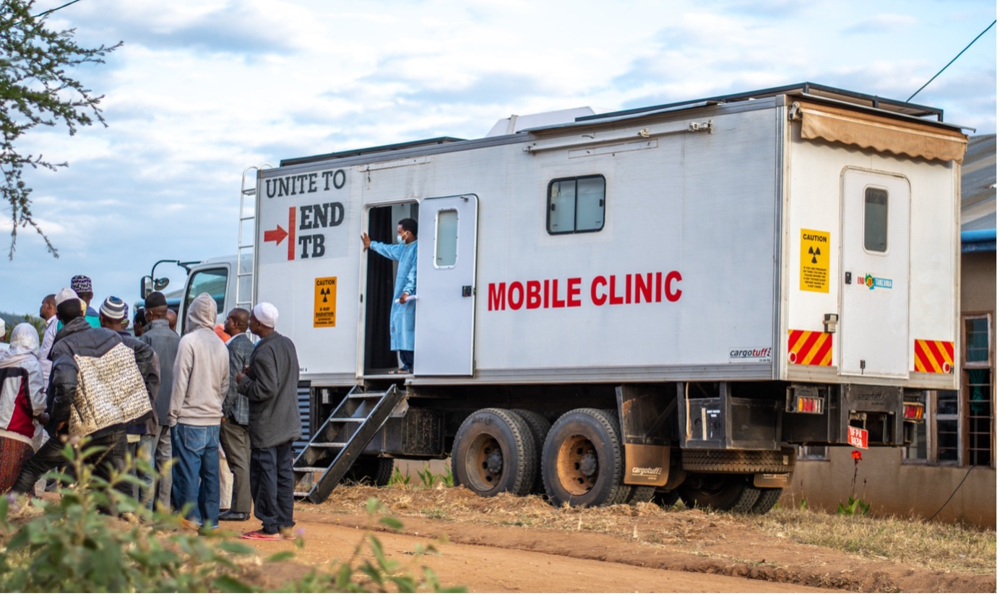

 

[Link to html slides](https://russlewisbo.github.io/TBdrugs/anti-tb-drugs-slides.html#/anti-tuberculosis-antibiotics)   [Link to recorded lecture]()

## Introduction and Scope

These notes accompany a 1.5-hour lecture on the pharmacology of antituberculous drugs for postgraduate infectious diseases specialists. The emphasis is on reasoning from mechanism, pharmacokinetics, and resistance biology to regimen design, and on the substantial changes in tuberculosis (TB) therapeutics since the reference textbook chapters most trainees studied.

The therapeutic backbone of this material is Chapter 38, *Antimycobacterial Agents*, of *Mandell, Douglas, and Bennett's Principles and Practice of Infectious Diseases*, supplemented with current guidance and pivotal trials verified against the primary literature — most importantly the 2025 ATS/CDC/ERS/IDSA treatment update [@Saukkonen2025], the WHO consolidated guidelines on drug-resistant TB [@WHO2022mod4], and the trials that established modern all-oral regimens [@Dorman2021; @Conradie2020nixtb; @Conradie2022zenix; @Nyangwa2022; @Guglielmetti2025endtb].

::: callout-note
## Perspective

Guidance in this field is often US-centric. Where relevant, these notes flag European practice: EUCAST rather than CLSI breakpoints, WHO operational regimens (BPaLM/BPaL) as the primary framework for drug-resistant TB, and the epidemiology of imported drug-resistant strains seen in Italy.
:::

## The Global Burden and Why Pharmacology Has Changed

Tuberculosis is again the leading infectious cause of death worldwide, with roughly 10.6 million incident cases and 1.3 million deaths annually, and an estimated 410,000 cases of multidrug-resistant or rifampin-resistant (MDR/RR) TB per year, of which only a minority (roughly two in five) are diagnosed and treated [@WHO2023gtr].

{#fig-burden fig-align="center" width="60%"} Drug resistance is the principal driver of pharmacological complexity, and the need for shorter, all-oral, better-tolerated regimens — so that programmatic treatment is feasible at scale — has propelled the fastest period of TB drug development in decades.

### Resistance Definitions

Precise terminology matters because it dictates regimen choice.

- **Drug-susceptible (DS) TB** — susceptible to both rifampin and isoniazid.
- **Isoniazid-resistant, rifampin-susceptible TB (Hr-TB)** — a distinct and common category with its own recommended regimen.
- **Rifampin-resistant (RR) TB** — rifampin resistance is the sentinel event; RR-TB is managed as MDR-TB.
- **Multidrug-resistant (MDR) TB** — resistant to at least isoniazid and rifampin.
- **Pre-extensively drug-resistant (pre-XDR) TB** — MDR/RR-TB plus resistance to any fluoroquinolone.
- **Extensively drug-resistant (XDR) TB (2021 definition)** — MDR/RR-TB, plus fluoroquinolone resistance, plus resistance to at least one Group A drug (bedaquiline or linezolid) [@WHO2022mod4].

::: callout-important
## Update: the XDR definition changed in 2021

The older XDR definition (MDR plus a fluoroquinolone plus a second-line **injectable**) is obsolete. WHO redefined XDR around the drugs that now anchor treatment — fluoroquinolones and the Group A oral agents bedaquiline and linezolid — reflecting that injectables are no longer core drugs.
:::

## Foundational Pharmacology

### Bacillary Populations and Drug Niches

The single most useful conceptual model is that *M. tuberculosis* exists in the host as distinct sub-populations occupying different microenvironments, and that drugs differ in which population they reach and kill (Table @tbl-niches). Regimen design is fundamentally the effort to hit all populations simultaneously (@fig-populations).

{#fig-populations fig-align="center" width="80%"}

| Population / niche | Best drugs |
|------------------------------------|------------------------------------|
| Rapidly replicating, extracellular (cavity walls) | Isoniazid (fastest early kill), rifampin |
| Slowly/intermittently replicating, intracellular (acidic phagolysosome) | Pyrazinamide, rifampin |
| Near-dormant persisters in caseous necrotic foci | Rifampin (sterilizing), pyrazinamide |
| Companion / resistance protection | Ethambutol |

: Antituberculous drugs mapped to bacillary sub-populations {#tbl-niches}

### Bactericidal versus Sterilizing Activity

Two properties must be kept distinct. **Early bactericidal activity (EBA)** is the rate of kill of actively dividing bacilli in the first days of therapy, best exemplified by isoniazid; it drives the early fall in sputum burden and infectiousness. **Sterilizing activity** is the capacity to kill persisters and prevent relapse, best exemplified by rifampin and pyrazinamide. Crucially, regimen shortening depends on sterilizing power, not EBA — which is why rifamycin optimization (higher doses, rifapentine) and the addition of moxifloxacin are the levers used to shorten drug-susceptible therapy [@Dorman2021].

### The Arithmetic of Resistance

Spontaneous resistance mutations pre-exist in any large bacillary population. Approximate mutation frequencies are \~1 in 10⁶ for isoniazid and \~1 in 10⁸ for rifampin, so a doubly-resistant mutant arises at \~1 in 10¹⁴. Because a pulmonary cavity holds 10⁸–10¹⁰ organisms, single-drug therapy simply selects pre-existing resistant mutants — more than 70% of patients treated with isoniazid monotherapy for active disease acquire resistance. Two independent effective drugs render the joint mutant vanishingly rare. The clinical corollary is the cardinal rule of TB therapy: **never add a single new drug to a failing regimen** — that is functional monotherapy [@Iseman1993].

### Resistance Mechanisms at a Glance

| Drug | Target / mechanism | Resistance gene(s) |
|------------------------|------------------------|------------------------|
| Isoniazid | Mycolic acid synthesis (pro-drug activated by KatG) | *katG*, *inhA* |
| Rifampin | DNA-dependent RNA polymerase β-subunit | *rpoB* |
| Pyrazinamide | Pyrazinoic acid (pro-drug activated by PncA) | *pncA* |
| Ethambutol | Arabinosyl transferase | *embB* |
| Streptomycin / amikacin | Ribosome (protein synthesis) | *rpsL*, *16S rRNA* |
| Fluoroquinolones | DNA gyrase | *gyrA* |
| Bedaquiline / clofazimine | ATP synthase / efflux pump | *atpE*, *Rv0678* (*mmpR*) |

: Mechanisms and molecular resistance determinants

Molecular diagnostics (Xpert MTB/RIF, line-probe assays, targeted next-generation sequencing) interrogate exactly these determinants and now return actionable resistance results within days, limiting empirical exposure to toxic second-line drugs [@Egelund2012].

### Supervised Therapy and Adherence

The best regimen fails without adherence. Universal **supervised therapy** — in-person or video directly observed therapy (DOT) — remains central to preventing acquired resistance, and malabsorption (for example in advanced HIV/AIDS) can produce subtherapeutic drug levels that select resistance even in an adherent patient. Adherence support, not just drug choice, determines outcome. Fixed-dose combination tablets help on both fronts: they reduce pill burden and make inadvertent monotherapy impossible.

## First-Line Antituberculous Drugs

| Drug | Mechanism | Resistance gene | Signature toxicity |
|------------------|------------------|------------------|------------------|
| Isoniazid (H) | Inhibits mycolic acid synthesis | *katG*, *inhA* | Hepatitis, peripheral neuropathy |
| Rifampin (R) | Inhibits DNA-dependent RNA polymerase | *rpoB* | Hepatitis, potent CYP induction |
| Pyrazinamide (Z) | Pro-drug → pyrazinoic acid (acid pH) | *pncA* | Hepatitis, hyperuricemia |
| Ethambutol (E) | Inhibits arabinosyl transferase | *embB* | Optic neuritis |

: First-line agents at a glance

### Isoniazid

Isoniazid is a synthetic pro-drug activated by the mycobacterial catalase-peroxidase (KatG); its active metabolite inhibits InhA and blocks mycolic acid synthesis. It has the best early bactericidal activity of any TB drug against dividing organisms (MIC 0.02–0.05 µg/mL) but is weak against non-replicating bacilli. High-level resistance arises from *katG* mutations (loss of activation), whereas *inhA* promoter mutations produce low-level resistance and cross-resistance to ethionamide [@Musser1996; @Musser1995].

Isoniazid is well absorbed, distributes widely (cerebrospinal fluid \~20% of plasma, higher with inflamed meninges), and is metabolized by hepatic N-acetyltransferase with genetically determined fast and slow acetylator phenotypes; daily dosing overcomes acetylator differences. No renal adjustment is needed. A practical compounding pitfall: ascorbic acid (vitamin C) can inactivate isoniazid in suspensions and should be avoided in compounded syrups.

::: callout-warning
## Hepatotoxicity and neuropathy

Clinically significant hepatitis occurs in \~0.1–0.6% and rises with age, alcohol, pre-existing liver disease, and the peripartum period; severe cases are idiosyncratic and can occur despite recent normal liver enzymes, so **symptom-based monitoring and prompt discontinuation** are the safety net [@Saukkonen2006; @CDC2010INHliver]. Peripheral neuropathy results from pyridoxine (vitamin B6) depletion and is prevented with pyridoxine 10–25 mg/day, given routinely and essential in pregnancy, diabetes, alcohol use, HIV, renal failure, and malnutrition.
:::

Isoniazid inhibits the metabolism of phenytoin, carbamazepine, and valproate. The adult dose is 5 mg/kg/day (maximum 300 mg). Fixed-dose combinations with rifampin ± pyrazinamide improve adherence and make inadvertent monotherapy impossible.

### Rifampin

Rifampin inhibits the β-subunit of DNA-dependent RNA polymerase (human polymerase is insensitive). It is bactericidal against dividing organisms and — decisively — active against slow and near-dormant persisters, making it the sterilizing backbone that allowed six-month therapy (MIC 0.005–0.2 µg/mL; sputum conversion is roughly two weeks faster in rifampin-containing regimens). About 95% of resistance derives from point mutations in an 81-base-pair region of *rpoB*, rapidly detectable by molecular assay; rifampin resistance implies cross-resistance to rifapentine (always) and usually rifabutin — though roughly a quarter of rifampin-resistant strains remain rifabutin-susceptible, a phenotype of uncertain clinical exploitability.

::: callout-important
## The dominant interaction problem

Rifampin is a potent inducer of CYP3A4, 2C9, 2C19, P-glycoprotein, and UGT, interacting with more than 100 drugs, and the induction persists for weeks after discontinuation [@Venkatesan1992]. Clinically dangerous consequences include oral contraceptive failure, warfarin/DOAC under-anticoagulation, azole antifungal failure, and profound reductions in antiretroviral exposure — rifampin is contraindicated with most boosted protease inhibitors, mandating rifabutin substitution, and dolutegravir must be dose-doubled.
:::

Rifampin is best absorbed on an empty stomach, autoinduces its own metabolism over 1–2 weeks, and causes harmless orange-red discoloration of secretions. The adult dose is 10 mg/kg/day (maximum 600 mg); the historical 600 mg cap may be suboptimal, and trials of high-dose rifampin (up to 35 mg/kg) show steeper kill with acceptable tolerability, though this is not yet standard [@vanIngen2011].

### Pyrazinamide

Pyrazinamide is a pro-drug activated by pyrazinamidase (PncA) to pyrazinoic acid; it is uniquely active at acid pH, killing the intracellular semi-dormant population in phagolysosomes, and does little at neutral pH. It is an essential sterilizing component of the first two months, without which relapse rates are unacceptable. Resistance is via *pncA*; nearly half of MDR isolates are also pyrazinamide-resistant [@Scorpio1997]. It is now recognised as the most common cause of hepatotoxicity within multidrug regimens at modern doses, and it causes hyperuricemia (usually asymptomatic; symptomatic gout mainly in the predisposed). The dose is 20–25 mg/kg/day (maximum \~2 g); it is renally cleared and dosed after dialysis. The rifampin–pyrazinamide latent-TB regimen was abandoned because of severe hepatotoxicity.

### Ethambutol

Ethambutol inhibits arabinosyl transferase (*embB*), blocking arabinogalactan synthesis in the mycobacterial cell wall; it is bacteriostatic and functions mainly as a companion drug, protecting rifampin from acquired resistance when unrecognised isoniazid resistance is present, and it is dropped once isoniazid and rifampin susceptibility are confirmed [@Belanger1996; @Alcaide1997].

::: callout-warning
## Optic neuritis

Dose- and duration-dependent retrobulbar (optic) neuritis presents as bilateral blurred vision, reduced acuity, and red–green colour vision loss. Baseline and monthly acuity and colour testing are recommended, and patients must be instructed to stop the drug and report new visual symptoms promptly; recovery depends on early discontinuation. Ethambutol is renally cleared and requires dose adjustment in renal impairment.
:::

### First-Line Dosing Reference

| Drug | Adult daily dose | Note |
|------------------------|------------------------|------------------------|
| Isoniazid | 5 mg/kg (max 300 mg) | with pyridoxine |
| Rifampin | 10 mg/kg (max 600 mg) | empty stomach |
| Pyrazinamide | 20–25 mg/kg (max \~2 g) | renal adjustment; dose after dialysis |
| Ethambutol | 15 mg/kg (25 mg/kg if thrice weekly) | renal adjustment; eye monitoring |
| Rifabutin | \~5 mg/kg (\~300 mg) | HIV/protease-inhibitor settings |
| Rifapentine | 1200 mg daily (4-month regimen) | with food |

: Dosing quick reference

## Regimens for Drug-Susceptible TB

### The Standard Six-Month Regimen

The standard regimen is an intensive phase of isoniazid, rifampin, pyrazinamide, and ethambutol (RIPE) daily for two months, followed by a continuation phase of isoniazid and rifampin for four months (six months total). Ethambutol is dropped once pan-susceptibility is confirmed, pyridoxine is given throughout, and the continuation phase is extended to seven months total for cavitary disease with a positive two-month culture [@Nahid2016DSTB]. Viewed through the population model, RIPE covers the cavity (H), intracellular acid (Z), and persister (R) populations simultaneously, with ethambutol as resistance insurance.

### The Four-Month Rifapentine–Moxifloxacin Regimen

Study 31 (a phase 3 randomized trial) established a four-month regimen — two months of rifapentine, isoniazid, pyrazinamide, and moxifloxacin, then two months of rifapentine, isoniazid, and moxifloxacin — as non-inferior to standard six-month therapy for drug-susceptible pulmonary TB [@Dorman2021]. High-exposure daily rifapentine plus the sterilizing contribution of moxifloxacin permit the two-month saving, validating the sterilizing-activity thesis. CDC interim guidance (2022) endorsed it as an option for patients aged ≥12 and ≥40 kg with documented fluoroquinolone and rifamycin susceptibility, and it is embedded in the 2025 ATS/CDC/ERS/IDSA update, which also endorses a shorter four-month regimen for children with non-severe disease [@Carr2022; @Saukkonen2025]. Rifapentine must be taken with food.

### Isoniazid-Resistant, Rifampin-Susceptible TB

Hr-TB is more common than MDR-TB and is easily under-treated if isoniazid is simply dropped from standard therapy. The recommended regimen is rifampin, ethambutol, pyrazinamide, and levofloxacin for six months [@Nahid2019drtb].

### Monitoring the Response

Baseline assessment includes cultures with drug-susceptibility testing, liver enzymes as indicated, visual testing if ethambutol is used, HIV testing, and weight. Sputum smear and culture at two months is the key milestone: a positive culture (especially with baseline cavitation) predicts relapse and drives extension of the continuation phase. Otherwise, monitoring is clinical, monthly, adherence-focused, and directed at the drug-specific toxicities.

### Latent TB Infection

Treatment of latent infection has shifted to short rifamycin-based regimens with better completion and less hepatotoxicity than nine months of isoniazid: 3HP (weekly rifapentine plus isoniazid for 12 weeks), 4R (daily rifampin for four months), and 3HR (daily rifampin plus isoniazid for three months) [@Sterling2011; @Borisov2018]. Active disease must be excluded before treating latent infection.

## Rifamycins Beyond Rifampin

### Rifabutin

Rifabutin shares rifampin's target but is a weaker CYP3A4 inducer, making it the preferred rifamycin with HIV protease inhibitors [@Blaschke1996; @OBrien1987]. Its long half-life and high tissue penetration are advantageous; toxicities include uveitis (potentiated by clarithromycin, ritonavir, and azoles that raise rifabutin levels), neutropenia, and pseudojaundice.

### Rifapentine

Rifapentine has a long half-life and — unlike rifampin — increased bioavailability with food. Beyond its role in the four-month active-TB regimen, once-weekly rifapentine plus isoniazid (3HP) is a preferred latent-TB regimen [@Sterling2011; @Alfarisi2017]. It is contraindicated in HIV patients on protease inhibitors or NNRTIs.

## Second-Line and Repurposed Agents

### Fluoroquinolones

Moxifloxacin and levofloxacin inhibit DNA gyrase (*gyrA*), are bactericidal with excellent tissue and CNS penetration, and are now Group A drugs central to drug-resistant regimens; the older ciprofloxacin and ofloxacin are too weak and should not be counted as effective [@Ginsburg2003; @Nahid2019drtb]. Fluoroquinolone resistance defines pre-XDR-TB, so susceptibility testing is critical before regimen construction. The principal safety concern is QT-interval prolongation (moxifloxacin more than levofloxacin), additive with bedaquiline, clofazimine, and delamanid; other adverse effects include tendinopathy, dysglycemia, and CNS effects. Absorption is reduced by divalent cations, which must be separated by at least two hours.

Ciprofloxacin and ofloxacin are too weak and should not be counted as effective [@Ginsburg2003; @Nahid2019drtb]. Doses are levofloxacin 750–1000 mg/day (renally cleared — adjust) and moxifloxacin 400 mg/day (higher for CNS disease or elevated MIC). A practical hazard: empirical fluoroquinolones prescribed for "pneumonia" partially treat unrecognised TB and select fluoroquinolone resistance.

### Linezolid

Linezolid inhibits protein synthesis at the 23S rRNA, has essentially complete oral bioavailability, and is now a Group A cornerstone that replaced the weaker, more toxic older oral agents [@Lee2012]. Its toxicity — myelosuppression (reversible), peripheral and optic neuropathy (potentially irreversible), and lactic acidosis — arises from mitochondrial protein synthesis inhibition and is cumulative.

::: callout-note
## Dosing distinction and the ZeNix result

For TB, linezolid is dosed 600 mg **once** daily (not the 600 mg twice-daily dosing used for resistant gram-positive infection). The ZeNix trial optimized dose and duration within BPaL and showed that 600 mg for 26 weeks preserves efficacy with markedly less neuropathy and myelosuppression than higher/longer exposure — establishing the modern linezolid exposure [@Conradie2022zenix].
:::

### Injectable Agents

Amikacin, streptomycin, capreomycin, and kanamycin inhibit protein synthesis and were once central to MDR therapy but are now relegated to salvage use, displaced by all-oral regimens because of irreversible ototoxicity, nephrotoxicity, and vestibular toxicity [@Nahid2019drtb]. Where an injectable is unavoidable, amikacin is preferred (drug levels are widely available for TDM). Streptomycin, the first effective antituberculous drug, retains susceptibility-testing relevance; it is not cross-resistant with amikacin unless there has been prior aminoglycoside exposure, and it is more vestibulotoxic than the others.

### Older Oral Agents

Cycloserine (cell-wall synthesis; neuropsychiatric toxicity including seizures and suicidality; requires TDM, peak 20–35 µg/mL), ethionamide/prothionamide (mycolic acid synthesis; severe gastrointestinal intolerance, hypothyroidism, *inhA* cross-resistance with isoniazid), and para-aminosalicylic acid (folate pathway; severe gastrointestinal intolerance) have been largely retired by linezolid, bedaquiline, and better companions, and are reserved for salvage [@Nahid2019drtb].

### Clofazimine and β-Lactams

Clofazimine is a Group B companion in MDR regimens; it causes skin and conjunctival discoloration and QT prolongation, and — importantly — efflux-pump mutations (*Rv0678*/*mmpR*) can confer cross-resistance to both clofazimine and bedaquiline. Meropenem–clavulanate exploits clavulanate inhibition of the mycobacterial BlaC β-lactamase but is intravenous and reserved for difficult resistance patterns [@DeLorenzo2013].

## The Novel Agents

### Bedaquiline

Bedaquiline is a diarylquinoline that inhibits mycobacterial ATP synthase — a unique target with no cross-resistance to existing classes — and is slowly bactericidal [@Andries2005; @VanHeeswijk2014]. It is a Group A drug central to all modern all-oral regimens. Its terminal half-life is extraordinarily long (\~5.5 months), it is CYP3A4-metabolized (levels fall with rifampin, rise with strong inhibitors), and it prolongs QT via its M2 metabolite. An original black-box warning based on excess deaths in a small phase 2b trial has not been confirmed in large-scale programmatic use [@Diacon2009; @Avorn2013]. Baseline and serial ECG with correction of potassium, magnesium, and calcium are required. The conventional dose is 400 mg daily for two weeks, then 200 mg three times weekly (or weight-based short-course dosing).

### Pretomanid and Delamanid

Both nitroimidazoles are bioreductively activated to generate reactive species damaging mycolic acid synthesis and respiration, are active against replicating and non-replicating bacilli, and have low interaction potential (no rifampin-like induction) [@Gils2022; @Gler2012]. **Pretomanid is approved only as part of the BPaL/BPaLM combination** and should not be used as a standalone or substitutable drug. Delamanid received earlier EMA conditional approval but its phase 3 efficacy signal was weaker, and an endTB observational analysis found little added value when delamanid was appended to three already-strong drugs [@Rodriguez2023endtb]; it also prolongs QT.

## Modern Regimens for Drug-Resistant TB

### BPaL and ZeNix

The Nix-TB trial established BPaL — bedaquiline, pretomanid, and linezolid, all oral for six months — achieving roughly 90% favourable outcomes in highly drug-resistant (XDR, treatment-intolerant, or failing MDR) pulmonary TB, a population with historically dismal prognosis, and led to pretomanid's 2019 approval within the regimen [@Conradie2020nixtb]. The ZeNix trial then optimized the linezolid component — comparing 1200 vs 600 mg and 26 vs 9 weeks within BPaL — and showed that 600 mg for 26 weeks minimizes toxicity while preserving efficacy [@Conradie2022zenix].

### BPaLM — The New Standard for RR/MDR-TB

The TB-PRACTECAL trial showed that BPaLM (BPaL plus moxifloxacin, 24 weeks, all oral) is **superior** to the standard 9–20 month regimen for rifampin-resistant/MDR-TB, on both efficacy and safety [@Nyangwa2022]. WHO now recommends BPaLM as the preferred regimen for most RR/MDR-TB where fluoroquinolone susceptibility is present, with BPaL as the fallback when moxifloxacin cannot be used, and the approach is endorsed in the 2025 ATS/CDC/ERS/IDSA update [@Saukkonen2025].

### endTB — Expanding the Menu

The endTB randomized trial found several nine-month, all-oral, bedaquiline/delamanid-based regimens non-inferior to the standard for fluoroquinolone-susceptible RR/MDR-TB, expanding options for drug intolerance or availability constraints [@Guglielmetti2025endtb]. Its companion observational analysis reinforced that regimen strength matters more than drug count [@Rodriguez2023endtb].

### WHO Drug Groupings

When a standardized shortened regimen cannot be used, longer individualized regimens are built by the A→B→C hierarchy [@WHO2022mod4].

| Group | Drugs |
|------------------------------------|------------------------------------|
| A (use all three unless contraindicated) | Levofloxacin/moxifloxacin, bedaquiline, linezolid |
| B (add one or both) | Clofazimine, cycloserine/terizidone |
| C (complete the regimen) | Ethambutol, delamanid, pyrazinamide, imipenem–cilastatin/meropenem, amikacin, ethionamide, PAS |

: WHO drug groupings for individualized MDR/RR-TB regimens

That the injectables and older bacteriostatics have fallen to Group C encapsulates the entire trajectory of modern TB therapeutics.

## Cross-Cutting Principles

### Co-Treating TB and HIV

Both infections are treated, TB therapy first and then antiretroviral therapy (ART) without undue delay: for CD4 \<50 cells/mm³ start ART within two weeks, and for CD4 ≥50 by 8–12 weeks (individualized, with caution in TB meningitis where early ART increases harm) [@NIH_ARV]. The pharmacological hazard is the rifamycin–ART interaction, managed with rifabutin for protease-inhibitor regimens and dose-doubled dolutegravir with rifampin. Immune reconstitution inflammatory syndrome (IRIS) is managed while continuing both therapies [@CDC_TBHIV].

### Therapeutic Drug Monitoring

TDM is not routine but is essential where efficacy or toxicity is level-dependent — notably amikacin and cycloserine — and should be considered in malabsorption, HIV, diabetes, renal or hepatic dysfunction, slow response, and complex interactions. Guidelines are explicit that TDM cannot predict cure but enables rational dose adjustment. Less-invasive sampling matrices (dried blood spots, urine, saliva, hair) may widen feasibility in high-burden settings [@Rao2023tdm].

### QT Stewardship

Modern drug-resistant regimens stack QT-prolonging agents (bedaquiline, moxifloxacin, clofazimine, and sometimes delamanid). No single agent's effect is dramatic, but the additive burden warrants baseline and periodic ECG, maintenance of potassium and magnesium, avoidance of other QT-prolonging co-medications, and attention to ethionamide-induced hypothyroidism.

### Special Populations

In pregnancy, isoniazid (with pyridoxine), rifampin, and ethambutol are used; pyrazinamide is used routinely by WHO and in Europe but was historically deferred in the US; aminoglycosides (fetal ototoxicity) and, where alternatives exist, fluoroquinolones are avoided. In renal failure, pyrazinamide, ethambutol, levofloxacin, and aminoglycosides require adjustment (dose after dialysis), while isoniazid, rifampin, and moxifloxacin are usually unchanged. In hepatic disease, the isoniazid–rifampin–pyrazinamide trio requires caution and monitoring, and pyrazinamide-sparing regimens may be prudent. Children now have a shorter four-month option for non-severe disease [@Saukkonen2025].

### A European/Italian Perspective

European practice uses EUCAST rather than CLSI breakpoints, and the WHO operational regimens (BPaLM/BPaL) are the primary framework for RR/MDR-TB. Italian MDR epidemiology is influenced by imported strains from the former Soviet region, with a higher prevalence of fluoroquinolone and OXA-type resistance, directly affecting whether BPaLM or BPaL is appropriate and underscoring the value of rapid fluoroquinolone susceptibility testing.

## A Brief Tour: Nontuberculous Mycobacterial Therapy

Nontuberculous mycobacteria (NTM) are intrinsically more resistant than *M. tuberculosis*, with species-specific susceptibility; in-vitro results correlate with outcome for only a few drugs (macrolides and amikacin), and treatment is longer, multidrug, and often less satisfactory [@Griffith2007; @Daley2020ntm]. Distinguishing infection from colonization — especially for respiratory isolates — is essential before treating.

Macrolides (azithromycin, clarithromycin) are the cornerstone for macrolide-susceptible *Mycobacterium avium* complex (MAC) and *M. abscessus* subspecies, but must never be used as monotherapy: a 23S rRNA point mutation confers high-level, treatment-limiting cross-resistance. Amikacin — intravenous, or as liposomal inhaled suspension (ALIS) for refractory MAC — is the key second agent, and companion drugs (ethambutol and a rifamycin for MAC) protect the macrolide from resistance [@Daley2020ntm]. For MAC pulmonary disease the standard is macrolide + ethambutol + rifamycin, given three times weekly for nodular-bronchiectatic disease or daily for cavitary/severe disease. *M. abscessus* is the hardest common NTM because an inducible *erm(41)* methylase (functional in subspecies *abscessus* and *bolletii*) confers macrolide resistance on exposure; treatment requires prolonged multidrug therapy (amikacin plus a β-lactam such as imipenem or cefoxitin plus companions, sometimes with tigecycline or eravacycline), and outcomes remain poor. Newer agents under investigation include omadacycline, eravacycline, tedizolid, clofazimine, and synergistic dual β-lactam combinations.

## Key Takeaways

The stable pharmacology — bacillary populations, sterilizing versus bactericidal activity, and the arithmetic of resistance — explains every regimen, while the regimens themselves have shifted dramatically toward shorter, all-oral, better-tolerated therapy. First-line RIPE remains the backbone, with the four-month rifapentine–moxifloxacin regimen now a genuine option for eligible drug-susceptible disease. The two dominant safety themes are rifamycin CYP induction and the additive QT burden of modern regimens. For drug-resistant disease, BPaLM (six months, all oral) is preferred for RR/MDR-TB, injectables are last-resort, and bedaquiline, pretomanid, and linezolid (with or without moxifloxacin) are the new core drugs. Rapid molecular drug-susceptibility testing and targeted therapeutic drug monitoring individualize therapy.

::: callout-tip
## Selected key references

- Saukkonen et al. 2025 — ATS/CDC/ERS/IDSA treatment update [@Saukkonen2025]
- Nyang'wa et al. 2022 — TB-PRACTECAL / BPaLM [@Nyangwa2022]
- Conradie et al. 2020 (Nix-TB) & 2022 (ZeNix) — BPaL [@Conradie2020nixtb; @Conradie2022zenix]
- Dorman et al. 2021 — 4-month regimen (Study 31) [@Dorman2021]
- WHO Consolidated Guidelines, Module 4, 2022 [@WHO2022mod4]
- Nahid et al. 2019 — DR-TB guideline [@Nahid2019drtb]
:::

## References {.unnumbered}

::: {#refs}
:::
